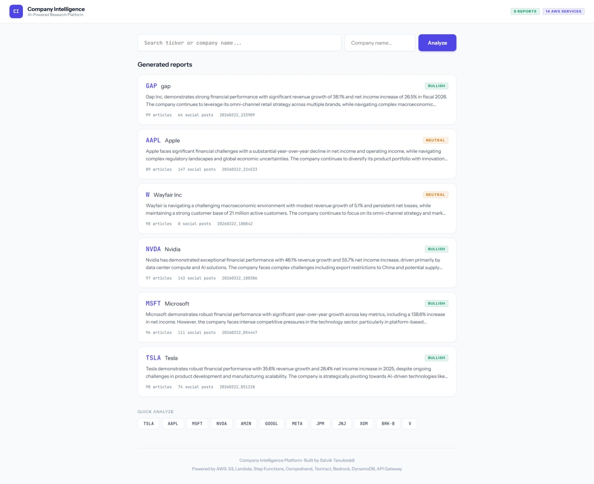
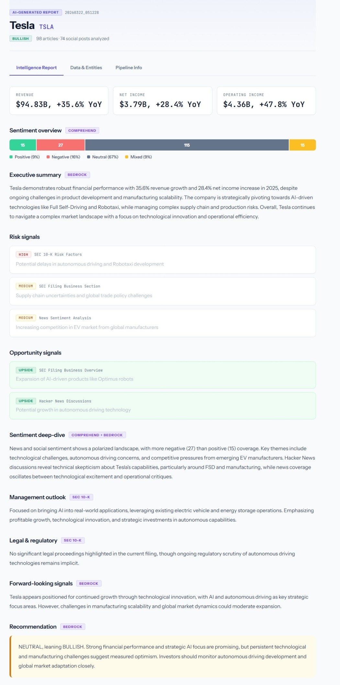
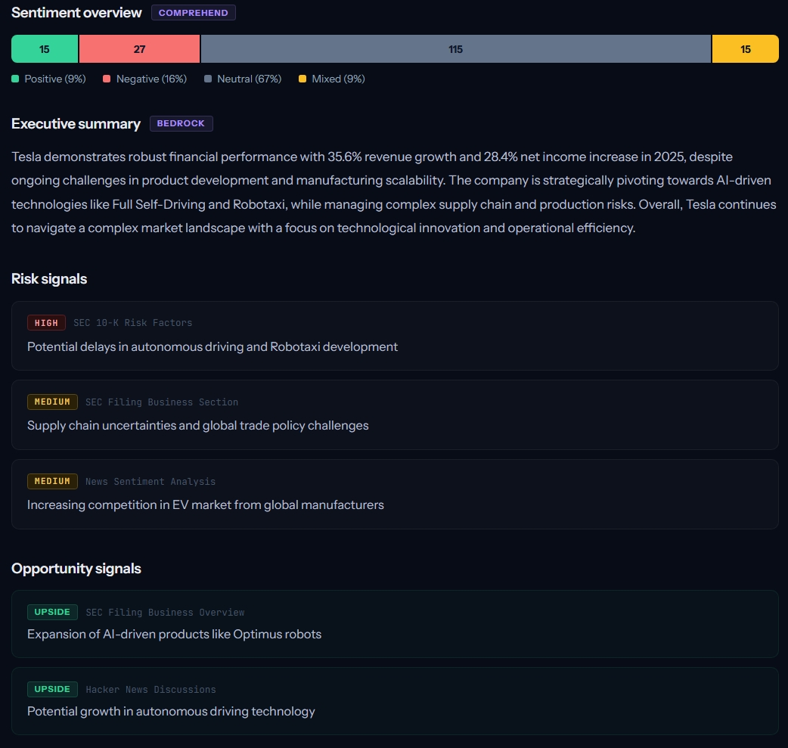
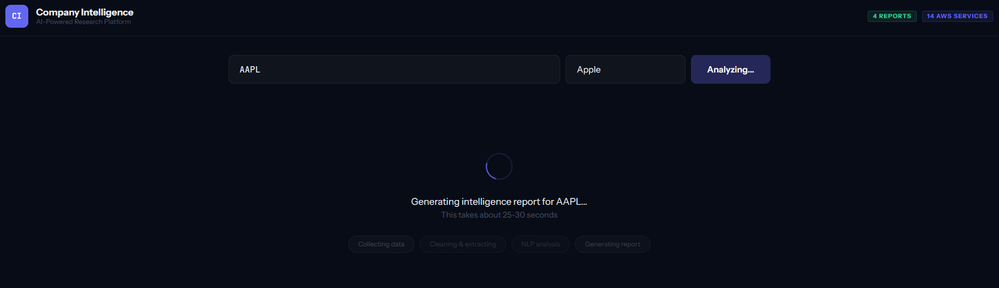
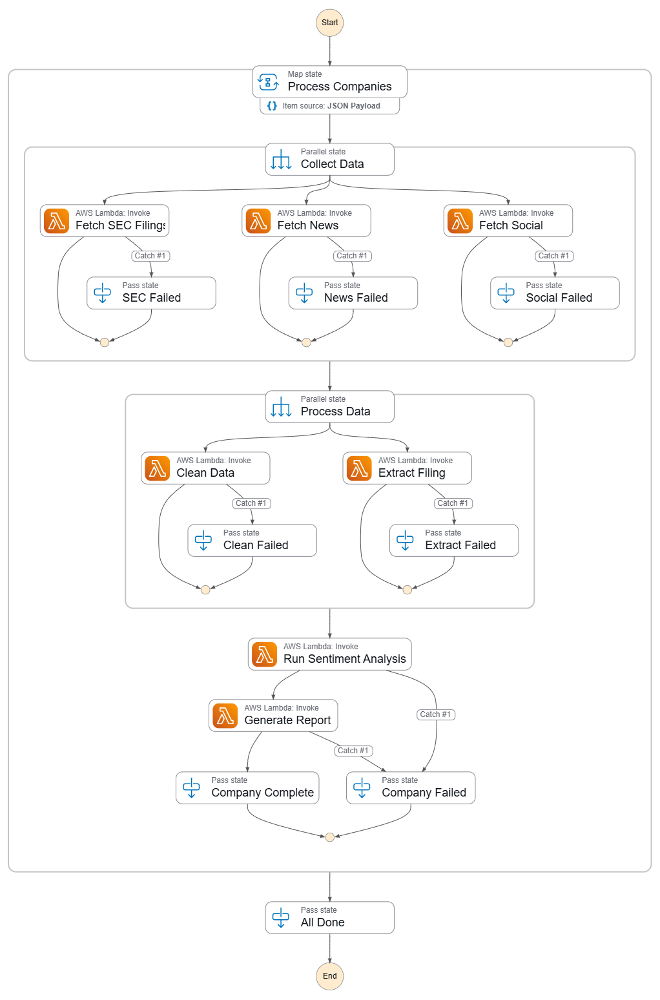
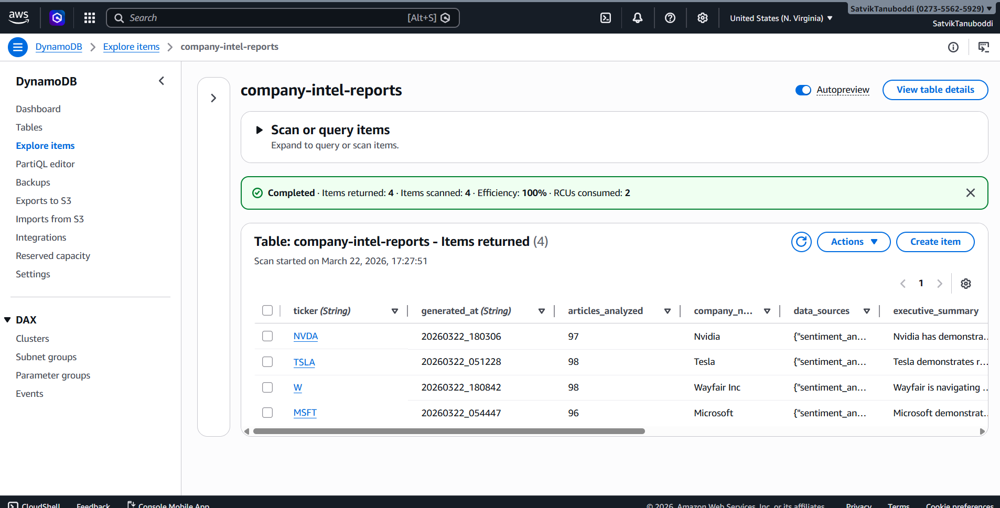

# 🏢 AI-Powered Company Intelligence Platform

> A serverless, end-to-end data intelligence platform that collects multi-source financial data, processes it through a medallion architecture, runs NLP analysis, and generates AI-powered intelligence reports — all on AWS.

[Serverless_AI_Blueprint.pptx](https://github.com/user-attachments/files/26173235/Serverless_AI_Blueprint.pptx)


## 🎯 What It Does

Enter any public company ticker → the platform automatically:

1. **Collects data** from 3 sources (SEC EDGAR, NewsAPI, Hacker News)
2. **Cleans & processes** raw data through a medallion pipeline (bronze → silver → gold)
3. **Extracts text** from SEC 10-K filings (Risk Factors, MD&A, Legal Proceedings)
4. **Analyzes sentiment** using AWS Comprehend (sentiment, entities, key phrases)
5. **Generates an AI report** using Amazon Bedrock (Claude 3.5 Haiku)
6. **Serves results** through a REST API and interactive dashboard

**~25 seconds end-to-end. ~$0.01 per report.**


https://github.com/user-attachments/assets/7c8f1392-8f0d-4663-adfd-170fe2f0c94c


## 📸 Screenshots

| Dashboard Home | Intelligence Report | Data & Entities |
|:-:|:-:|:-:|
|  |  |  |

| Pipeline Info | Step Functions | DynamoDB |
|:-:|:-:|:-:|
|  |  |  |

## 🏗️ Architecture

### AWS Services (14)

| Service | Role | Cost |
|---------|------|------|
| **S3** | Data lake (medallion: bronze/silver/gold) + static site hosting | $0.00 |
| **Lambda** (×8) | All compute — collectors, cleaners, analyzers, API handler | $0.00 |
| **Step Functions** | Pipeline orchestration with parallel execution | $0.00 |
| **EventBridge** | Scheduled daily triggers (6 AM CT) | $0.00 |
| **Comprehend** | NLP: sentiment analysis, named entity recognition, key phrases | $0.00* |
| **Textract** | SEC filing PDF/HTML text extraction | $0.00* |
| **Bedrock** | AI report generation (Claude 3.5 Haiku) | ~$0.003 |
| **DynamoDB** | Report metadata store for fast lookups | $0.00 |
| **API Gateway** | REST API (4 endpoints) | $0.00 |
| **Secrets Manager** | API key storage (NewsAPI) | $0.00 |
| **IAM** | Least-privilege security | $0.00 |
| **CloudWatch** | Logging and monitoring | $0.00 |

*Free tier covers project usage

### Medallion Architecture

```
┌─────────────────────────────────────────────────────────────┐
│  BRONZE (Raw)           SILVER (Cleaned)      GOLD (Enriched)│
│                                                               │
│  sec-filings/  ──→  filings/          ──→  sentiment/        │
│  news/         ──→  articles/              reports/           │
│  social/       ──→  social/                                   │
└─────────────────────────────────────────────────────────────┘
```

### Pipeline Flow

```
EventBridge (daily cron)
    │
    ▼
Step Functions (orchestrator)
    │
    ├──▶ COLLECT (parallel)
    │    ├── SEC EDGAR Collector    → bronze/sec-filings/
    │    ├── News Collector         → bronze/news/
    │    └── Social Collector       → bronze/social/
    │
    ├──▶ PROCESS (parallel)
    │    ├── Data Cleaner           → silver/articles/ + silver/social/
    │    └── Textract Processor     → silver/filings/
    │
    ├──▶ ANALYZE
    │    └── Comprehend Analyzer    → gold/sentiment/
    │
    ├──▶ GENERATE
    │    └── Bedrock Report Gen     → gold/reports/
    │
    └──▶ STORE
         └── DynamoDB + S3          → metadata + full report
```

### REST API

| Method | Endpoint | Description |
|--------|----------|-------------|
| `POST` | `/analyze` | Trigger pipeline for a company |
| `GET` | `/report/{ticker}` | Get latest intelligence report |
| `GET` | `/reports` | List all generated reports |
| `GET` | `/status/{id}` | Check pipeline execution status |

## 🔧 Lambda Functions (8)

| Function | Purpose | Memory | Timeout |
|----------|---------|--------|---------|
| `sec-edgar-collector` | Fetches SEC filings + XBRL financials | 256 MB | 90s |
| `news-collector` | Fetches articles from NewsAPI | 256 MB | 60s |
| `social-collector` | Fetches HN stories + comments | 256 MB | 60s |
| `data-cleaner` | Strips boilerplate, deduplicates, filters relevance | 256 MB | 60s |
| `textract-processor` | Extracts text from 10-K filings (HTML/PDF) | 512 MB | 300s |
| `sentiment-analyzer` | Runs Comprehend (sentiment, NER, key phrases) | 512 MB | 120s |
| `report-generator` | Builds prompt, calls Bedrock, stores in DynamoDB | 512 MB | 120s |
| `api-handler` | Routes API Gateway requests to DynamoDB/S3/Step Functions | 256 MB | 30s |

## 📊 Sample Report Output

**Tesla (TSLA)** — Generated March 22, 2026

- **Recommendation:** NEUTRAL, leaning BULLISH
- **Revenue:** $94.83B (+35.6% YoY)
- **Net Income:** $3.79B (+28.4% YoY)
- **Articles Analyzed:** 98
- **Social Posts Analyzed:** 74
- **Sentiment:** 15 positive, 27 negative, 115 neutral, 15 mixed
- **Key Risk:** CEO distraction, FSD regulatory uncertainty
- **Key Opportunity:** Energy storage growth, Robotaxi platform

## 🛠️ Tech Stack

**Languages:** Python 3.12, JavaScript (ES6+), HTML/CSS

**Data Sources:**
- SEC EDGAR (XBRL financials, 10-K full text)
- NewsAPI (real-time news articles)
- Hacker News Algolia API (tech community sentiment)

**AWS Services:** S3, Lambda, Step Functions, EventBridge, Comprehend, Textract, Bedrock, DynamoDB, API Gateway, Secrets Manager, IAM, CloudWatch

**Frontend:** Vanilla JavaScript, CSS custom properties, hosted on S3

## 📁 Project Structure

```
company-intel-platform/
├── lambda/
│   ├── sec-edgar-collector/
│   │   └── sec_edgar_collector.py
│   ├── news-collector/
│   │   └── news_collector.py
│   ├── social-collector/
│   │   └── social_collector.py
│   ├── data-cleaner/
│   │   └── data_cleaner.py
│   ├── textract-processor/
│   │   └── textract_processor.py
│   ├── sentiment-analyzer/
│   │   └── sentiment_analyzer.py
│   ├── report-generator/
│   │   └── report_generator.py
│   └── api-handler/
│       └── api_handler.py
├── step-functions/
│   └── pipeline-definition.json
├── frontend/
│   └── index.html
├── docs/
│   ├── architecture.png
│   └── screenshots/
│       ├── home.png
│       ├── report.png
│       ├── entities.png
│       ├── pipeline.png
│       ├── stepfunctions.png
│       └── dynamodb.png
├── sample-data/
│   ├── bronze-sec-tesla.json
│   ├── silver-articles-tesla.json
│   ├── silver-filings-tesla.json
│   ├── gold-sentiment-tesla.json
│   └── gold-report-tesla.json
└── README.md
```

## 🚀 Deployment Guide

### Prerequisites

- AWS account with billing enabled
- NewsAPI key ([newsapi.org](https://newsapi.org))
- AWS CLI configured (optional, for automation)

### Step 1: S3 Data Lake

Create bucket `company-intel-datalake-{yourname}` with folders:
```
bronze/sec-filings/  bronze/news/  bronze/social/
silver/filings/  silver/articles/  silver/social/
gold/sentiment/  gold/reports/
```

### Step 2: Secrets Manager

Store API keys in `company-intel/api-keys`:
```json
{ "newsapi_key": "your-key-here" }
```

### Step 3: IAM Role

Create `lambda-ingestion-role` with policies:
- AmazonS3FullAccess
- CloudWatchLogsFullAccess
- SecretsManagerReadWrite
- ComprehendFullAccess
- AmazonTextractFullAccess
- AmazonBedrockFullAccess
- AmazonDynamoDBFullAccess
- AWSStepFunctionsFullAccess

### Step 4: Lambda Functions

Deploy all 8 functions using Python 3.12 runtime with the IAM role above. Set handler to `{filename}.lambda_handler` for each.

### Step 5: Step Functions

Create state machine `company-intel-pipeline` using the definition in `step-functions/pipeline-definition.json`.

### Step 6: DynamoDB

Create table `company-intel-reports`:
- Partition key: `ticker` (String)
- Sort key: `generated_at` (String)
- Capacity: On-demand

### Step 7: API Gateway

Create REST API `company-intel-api` with 4 routes (see REST API section above), all using Lambda proxy integration to `api-handler`.

### Step 8: Frontend

Enable S3 static website hosting and upload `frontend/index.html`.

## 🧪 Testing

**Single company:**
```json
{
  "companies": [
    {"ticker": "TSLA", "company_name": "Tesla"}
  ]
}
```

**Multi-company (parallel):**
```json
{
  "companies": [
    {"ticker": "TSLA", "company_name": "Tesla"},
    {"ticker": "AAPL", "company_name": "Apple"},
    {"ticker": "MSFT", "company_name": "Microsoft"}
  ]
}
```

## 💡 Key Design Decisions

| Decision | Reasoning |
|----------|-----------|
| **Medallion architecture** | Clean separation of raw/cleaned/enriched data; enables reprocessing without re-collecting |
| **Step Functions over direct Lambda chaining** | Visual debugging, built-in retry/error handling, parallel execution |
| **Comprehend over custom ML** | Production-ready NLP without training data; batch API handles scale |
| **Textract for SEC filings** | Most 10-K filings are HTML (not PDF), so HTML parser handles 95% of cases; Textract handles the PDF remainder |
| **DynamoDB for metadata** | Sub-millisecond lookups by ticker + sort key; S3 for full report storage |
| **Hacker News over Reddit** | No API registration required; Algolia search API is fast and free |
| **Claude 3.5 Haiku** | Best cost/quality ratio for structured report generation; ~$0.003 per report |

## 📈 Performance

| Metric | Value |
|--------|-------|
| End-to-end pipeline | ~25 seconds |
| Cost per report | ~$0.01 |
| Articles per run | 50-100 |
| Social posts per run | 50-150 |
| SEC filings processed | Most recent 10-K |
| Concurrent companies | 3 (configurable) |
| Report sections | 10 (exec summary, sentiment, risks, opportunities, etc.) |

## 🔮 Future Enhancements
### Tier 2: Enterprise Enhancements
* **Data Cataloging & SQL Querying:** Integrate **AWS Glue** and **Amazon Athena** to run standard SQL queries directly against the JSON files in the S3 data lake.
* **Conversational AI:** Add **Amazon Bedrock Knowledge Bases** for managed RAG, enabling conversational Q&A chats directly with the financial data.
* **New Data Ingestion:** Use **Amazon Transcribe** to convert earnings call audio to text, and ingest Google News RSS/Google Trends for public interest signals.
* **Enterprise Security & Delivery:** Implement **Amazon Cognito** for custom user authentication, **Amazon CloudFront** as a global CDN for the frontend, and **Amazon SNS** for email/SMS pipeline failure alerts.
* **Infrastructure as Code (IaC):** Automate the deployment of the entire architecture using **AWS CloudFormation** or **AWS CDK**.

### Tier 3: Advanced Stretch Goals
*(Note: These services are highly resource-intensive and step beyond the standard AWS free tier)*
* **Real-Time Processing:** Shift from daily batch processing to real-time pipelines using **Amazon Kinesis** for data streaming and **EMR Serverless** for heavy Apache Spark processing.
* **Custom Machine Learning:** Train custom predictive models using **Amazon SageMaker** and implement vector-based semantic search with **OpenSearch Serverless**.
* **Advanced Media Analysis:** Incorporate **Amazon Rekognition** to read and analyze the charts and images embedded inside SEC PDF filings.
* **Multilingual & Audio Reports:** Offer AI intelligence reports in multiple languages and as playable audio files using **Amazon Translate** and **Amazon Polly**.

## 👤 Author

**Satvik Tanuboddi**
- Master's in Business Analytics & Information Systems (STEM) — University of South Florida
- [LinkedIn](https://linkedin.com/in/satvik-tanuboddi) | [GitHub](https://github.com/satvik-tanuboddi)

## 📄 License

This project is for portfolio/educational purposes. Data sourced from public APIs (SEC EDGAR, NewsAPI, Hacker News).
